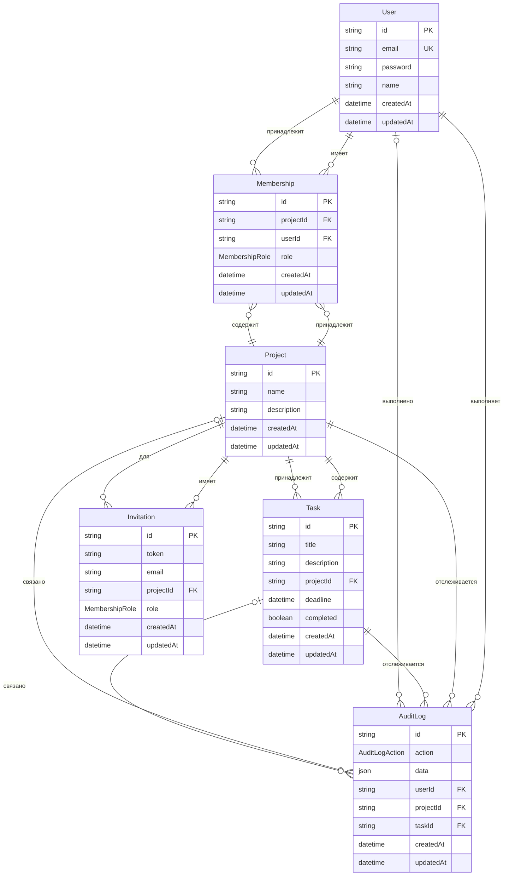

# Документация схемы базы данных

## Обзор

База данных WorkHub использует PostgreSQL в качестве провайдера базы данных. Схема определяет структуру данных для системы управления проектами и задачами с поддержкой ролевого доступа, аудита действий и системы приглашений.

## Диаграмма связей сущностей

## Модели

### User (Пользователь)

Модель представляет пользователя системы. Каждый пользователь имеет уникальный email и может быть участником нескольких проектов через модель Membership.

**Поля:**

- `id` (String, PK) — уникальный идентификатор пользователя, генерируется автоматически с помощью cuid()
- `email` (String, Unique) — электронная почта пользователя, должна быть уникальной
- `password` (String) — хешированный пароль пользователя
- `name` (String, Nullable) — имя пользователя (опционально)
- `createdAt` (DateTime) — дата и время создания записи, устанавливается автоматически
- `updatedAt` (DateTime) — дата и время последнего обновления записи, обновляется автоматически

**Связи:**

- `memberships` (Membership[]) — множество членств пользователя в проектах
- `auditLogs` (AuditLog[]) — множество записей аудита, связанных с действиями пользователя

---

### Project (Проект)

Модель представляет проект в системе. Проект может содержать задачи, иметь участников и приглашения.

**Поля:**

- `id` (String, PK) — уникальный идентификатор проекта, генерируется автоматически с помощью cuid()
- `name` (String) — название проекта
- `description` (String) — описание проекта
- `createdAt` (DateTime) — дата и время создания записи, устанавливается автоматически
- `updatedAt` (DateTime) — дата и время последнего обновления записи, обновляется автоматически

**Связи:**

- `memberships` (Membership[]) — множество членств в проекте
- `tasks` (Task[]) — множество задач проекта
- `auditLogs` (AuditLog[]) — множество записей аудита, связанных с проектом
- `invitations` (Invitation[]) — множество приглашений в проект

---

### Membership (Членство)

Модель представляет связь между пользователем и проектом с определённой ролью. Это промежуточная таблица для реализации связи многие-ко-многим между User и Project.

**Поля:**

- `id` (String, PK) — уникальный идентификатор членства, генерируется автоматически с помощью cuid()
- `projectId` (String, FK) — идентификатор проекта
- `project` (Project) — связь с проектом
- `userId` (String, FK) — идентификатор пользователя
- `user` (User) — связь с пользователем
- `role` (MembershipRole) — роль пользователя в проекте (OWNER, EDITOR, VIEWER)
- `createdAt` (DateTime) — дата и время создания записи, устанавливается автоматически
- `updatedAt` (DateTime) — дата и время последнего обновления записи, обновляется автоматически

**Связи:**

- `project` (Project) — проект, к которому относится членство
- `user` (User) — пользователь, которому принадлежит членство

---

### Task (Задача)

Модель представляет задачу в рамках проекта. Задача может иметь описание, дедлайн и статус выполнения.

**Поля:**

- `id` (String, PK) — уникальный идентификатор задачи, генерируется автоматически с помощью cuid()
- `title` (String) — название задачи
- `description` (String, Nullable) — описание задачи (опционально)
- `projectId` (String, FK) — идентификатор проекта, к которому относится задача
- `project` (Project) — связь с проектом
- `deadline` (DateTime, Nullable) — срок выполнения задачи (опционально)
- `completed` (Boolean) — статус выполнения задачи, по умолчанию false
- `createdAt` (DateTime) — дата и время создания записи, устанавливается автоматически
- `updatedAt` (DateTime) — дата и время последнего обновления записи, обновляется автоматически

**Связи:**

- `project` (Project) — проект, к которому относится задача
- `auditLogs` (AuditLog[]) — множество записей аудита, связанных с задачей

---

### AuditLog (Журнал аудита)

Модель представляет запись о действии пользователя в системе. Используется для отслеживания изменений в проектах и задачах.

**Поля:**

- `id` (String, PK) — уникальный идентификатор записи аудита, генерируется автоматически с помощью cuid()
- `action` (AuditLogAction) — тип действия (CREATE, UPDATE, DELETE)
- `data` (Json) — данные действия в формате JSON
- `userId` (String, FK) — идентификатор пользователя, выполнившего действие
- `user` (User) — связь с пользователем
- `projectId` (String, FK, Nullable) — идентификатор проекта, связанного с действием (опционально)
- `project` (Project, Nullable) — связь с проектом (опционально)
- `taskId` (String, FK, Nullable) — идентификатор задачи, связанной с действием (опционально)
- `task` (Task, Nullable) — связь с задачей (опционально)
- `createdAt` (DateTime) — дата и время создания записи, устанавливается автоматически
- `updatedAt` (DateTime) — дата и время последнего обновления записи, обновляется автоматически

**Связи:**

- `user` (User) — пользователь, выполнивший действие
- `project` (Project, Nullable) — проект, связанный с действием (если применимо)
- `task` (Task, Nullable) — задача, связанная с действием (если применимо)

---

### Invitation (Приглашение)

Модель представляет приглашение пользователя в проект. Приглашение содержит токен для принятия и роль, которая будет назначена пользователю.

**Поля:**

- `id` (String, PK) — уникальный идентификатор приглашения, генерируется автоматически с помощью cuid()
- `token` (String) — уникальный токен приглашения для принятия
- `email` (String) — электронная почта приглашаемого пользователя
- `projectId` (String, FK) — идентификатор проекта, в который приглашается пользователь
- `project` (Project) — связь с проектом
- `role` (MembershipRole) — роль, которая будет назначена пользователю при принятии приглашения
- `createdAt` (DateTime) — дата и время создания записи, устанавливается автоматически
- `updatedAt` (DateTime) — дата и время последнего обновления записи, обновляется автоматически

**Связи:**

- `project` (Project) — проект, в который отправлено приглашение

---

## Перечисления

### AuditLogAction

Перечисление определяет типы действий, которые могут быть зафиксированы в журнале аудита.

**Значения:**

- `CREATE` — создание новой сущности
- `UPDATE` — обновление существующей сущности
- `DELETE` — удаление сущности

**Использование:**

Используется в модели `AuditLog` для указания типа выполненного действия. Позволяет классифицировать и фильтровать записи аудита по типу операции.

---

### MembershipRole

Перечисление определяет роли пользователей в проектах. Роли определяют уровень доступа и прав пользователя.

**Значения:**

- `OWNER` — владелец проекта, имеет полный доступ и может управлять участниками
- `EDITOR` — редактор, может создавать и изменять задачи, но не может управлять участниками
- `VIEWER` — наблюдатель, может только просматривать проект и задачи

**Использование:**

Используется в моделях `Membership` и `Invitation` для определения роли пользователя в проекте. Роль в приглашении определяет, какая роль будет назначена пользователю при принятии приглашения.

---

## Сводка связей

### Многие-ко-многим

- **User ↔ Project** — реализовано через модель `Membership`. Один пользователь может быть участником нескольких проектов, один проект может иметь несколько участников. Каждое членство имеет свою роль.

### Один-ко-многим

- **Project → Task** — один проект может содержать множество задач. Каждая задача принадлежит одному проекту.
- **Project → Invitation** — один проект может иметь множество приглашений. Каждое приглашение относится к одному проекту.
- **User → AuditLog** — один пользователь может выполнить множество действий, зафиксированных в журнале аудита. Каждая запись аудита связана с одним пользователем.

### Опциональные связи

- **AuditLog → Project** — запись аудита может быть связана с проектом (если действие относится к проекту или его сущностям).
- **AuditLog → Task** — запись аудита может быть связана с задачей (если действие относится к задаче).

---

## Ограничения и индексы

### Первичные ключи

Все модели используют поле `id` типа String с автоматической генерацией через `cuid()` в качестве первичного ключа.

### Уникальные ограничения

- `User.email` — email пользователя должен быть уникальным
- `Invitation.token` — токен приглашения должен быть уникальным (предполагается)

### Внешние ключи

- `Membership.projectId` → `Project.id`
- `Membership.userId` → `User.id`
- `Task.projectId` → `Project.id`
- `AuditLog.userId` → `User.id`
- `AuditLog.projectId` → `Project.id` (опционально)
- `AuditLog.taskId` → `Task.id` (опционально)
- `Invitation.projectId` → `Project.id`

### Автоматические поля

- `createdAt` — автоматически устанавливается при создании записи
- `updatedAt` — автоматически обновляется при изменении записи
